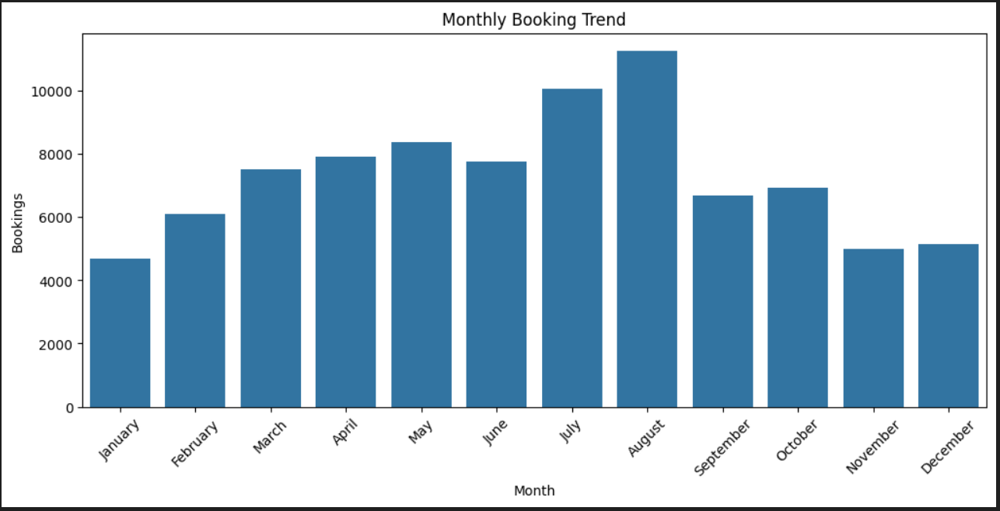
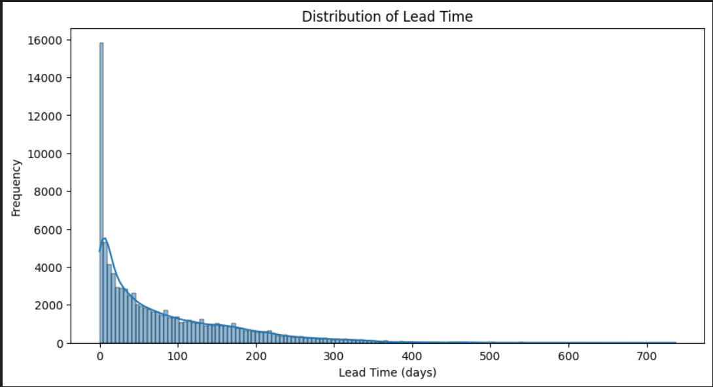
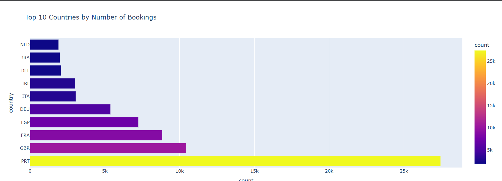

# Hotel Booking Demand & Cancellation Analysis

## Project Overview
This project performs Exploratory Data Analysis (EDA) on hotel booking data to understand booking patterns, cancellation behavior, seasonal demand, and customer stay characteristics across City and Resort hotels.

The objective is to uncover insights that can help hotels optimize operations, reduce cancellations, and improve revenue strategies.

---

## Dataset
The dataset contains hotel booking records including:

- Hotel type (City Hotel / Resort Hotel)
- Booking status (Canceled / Not canceled)
- Lead time between booking and arrival
- Arrival date information
- Guest details (adults, children, babies)
- Length of stay
- Distribution channels and market segments
- Customer country
- Special requests

---

## Tools & Technologies
- Python
- Pandas
- NumPy
- Matplotlib
- Seaborn
- Plotly
- Google Colab

---

## Analysis Performed

The following analyses were conducted:

- Bookings by hotel type
- Monthly booking trends
- Cancellation rate by hotel type
- Lead time distribution
- Cancellation rate by distribution channel
- Total nights distribution
- Top 10 countries by bookings
- Booking patterns by day of week

---

## Key Insights

- City hotels receive significantly more bookings than resort hotels.
- Bookings peak during the summer months (June–August).
- OTA and TA/TO channels show higher cancellation rates.
- Most bookings are made within 30 days of arrival.
- Most hotel stays range between 1–7 nights.
- Western Europe contributes the majority of bookings.

---

## Visualizations

### Monthly Booking Trend


### Cancellation Rate by Hotel Type


### Lead Time Distribution


### Top 10 Countries by Bookings



## Repository Structure

```
hotel-booking-demand-analysis
│
├── Booking.com colab.ipynb
├── Hotel Bookings.csv
└── README.md
```

---

## Author
Ashwin Shende
